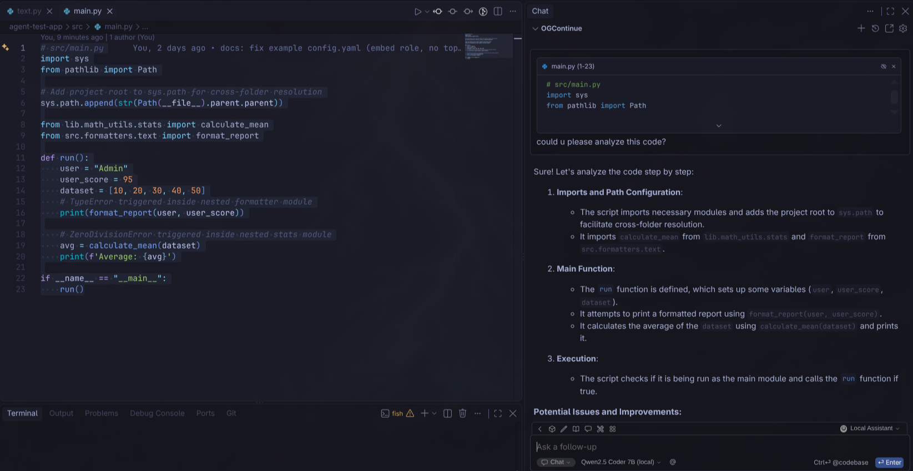
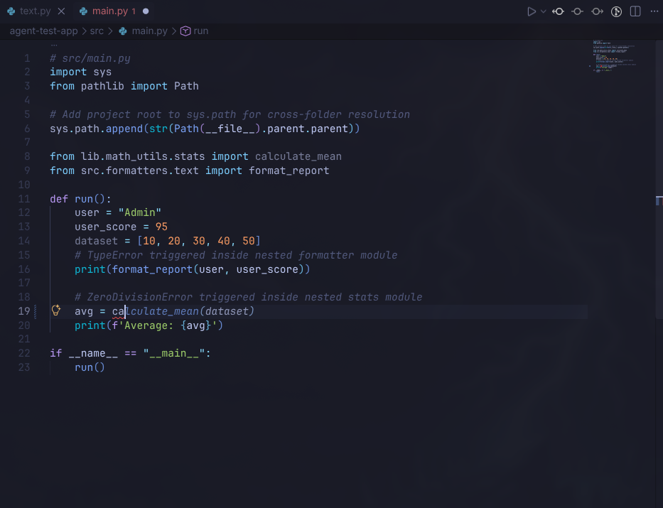
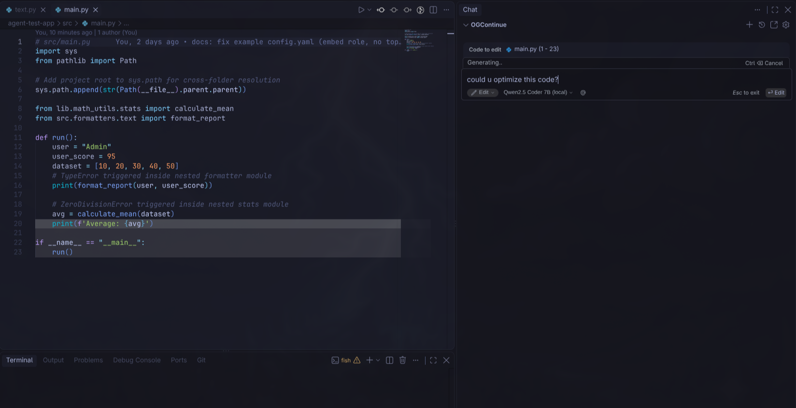
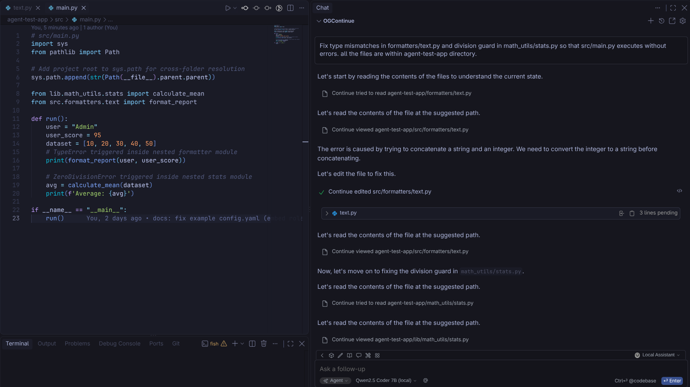

<h1 align="center">OGContinue</h1>

**OGContinue is a community-maintained fork of [Continue](https://docs.continue.dev) (based on the `v1.0.10-vscode` tag), focused on running fully locally with local models — no cloud, no accounts, no telemetry required. It is not affiliated with or endorsed by Continue Dev, Inc.**

> **About this fork**
> Upstream Continue stopped. Cursor (Anysphere) acquired the Continue team in June 2026, shipped a final `v2.0.0-vscode` release, and set the `continuedev/continue` repository to read-only; the hosted product was shut down soon after. OGContinue was forked from a snapshot well before that (`v1.0.10-vscode`), for a different reason: upstream Continue never worked reliably with local models in the first place. Agent mode in particular was built assuming a frontier-class hosted model behind every tool call, and fell apart on the small (7B-class) models people actually run locally - which is most of what this fork rebuilds. See [CHANGES.md](./CHANGES.md) for the full list.
> Distributed under the same [Apache 2.0](./LICENSE) license as the original project. See [CHANGES.md](./CHANGES.md) for a summary of what's different from upstream.
>
> "Continue" and the Continue logo are trademarks of Continue Dev, Inc. This is an independent, unofficial fork; no trademark rights are claimed or implied.
>
> **Platform focus:** OGContinue targets **VS Code only**. The JetBrains/IntelliJ and CLI variants inherited from upstream have been removed from this repo — all effort goes into making the VS Code extension work well.
>
> **Maintainer note:** This is a solo, spare-time project. I mostly get to work on it during summer/vacation breaks, so support, issue responses, and new releases can be slow the rest of the year — thanks for your patience.

## Why OGContinue?

Upstream Continue treats local models as a secondary path — most of its polish targets hosted, API-key models. OGContinue flips that: **local models via [Ollama](https://ollama.com) are the primary target**, not an afterthought, because they were the most neglected part of the original project.

Concretely, that means Chat, Autocomplete, Edit, and Agent are all made to work reliably with local models — including small (7B-class and below) ones that struggle with tool-calling and instruction-following compared to hosted frontier models. Larger local models and hosted API-key models still work exactly as before — this is about not leaving the smaller end of the range broken.

### How Agent mode stays reliable on small models

Upstream Continue's Agent mode was built around a model reliably calling tools through the API and accurately narrating its own progress. Small local models routinely do neither — one 7B model tested against this fork's [evaluation harness](./manual-testing-sandbox/agent-eval) never used the native tool-calling API even once, printing every single call as plain text instead, and both tested models will describe a step ("Let's fix the division guard...") without actually taking it if nothing catches that. Rather than hoping a bigger system prompt fixes this, OGContinue builds around it:

- **Tool calls are recovered from plain text.** If a model prints `{"name": "...", "arguments": {...}}` or a bare `tool_name {...}` instead of using the tool-calling API, it's parsed back into a real call. This isn't a rare fallback — it's the primary path for some models.
- **The model declares its own plan**, via a `set_task_plan` tool call, for tasks the harness can't infer a plan for from the request text alone. Progress is recited against that plan at the end of every turn — restating what's done, what's left, and the next concrete action — which keeps a model from losing the thread of a multi-step task instead of relying on it to remember on its own.
- **An explicit `task_complete` tool ends a turn**, and calling it is checked against that same progress before it's accepted — so a model can't declare the task finished while a file it was asked to change is still untouched, or a command it was asked to run has never actually succeeded.
- **A response that only describes an edit or a next step, instead of making the tool call, is reconstructed and carried out automatically** rather than asked for again — the description usually already contains everything the call needs.
- **The terminal tool corrects a wrong path and retries once**, instead of only telling the model where the file really is and hoping it tries again itself.
- **File paths resolve tolerantly everywhere** — a model that gets a path slightly wrong (missing a folder, an extra one) still finds the file instead of failing outright.

All of this is deliberately model-agnostic — none of it is tuned to one model's phrasing — and it's measured, not assumed: the [`agent-eval`](./manual-testing-sandbox/agent-eval) harness runs a real broken project through a real model over Ollama and checks the result behaviourally, so a change to this logic can be judged by whether it actually fixes more runs rather than by how it reads in a transcript. See [docs/LOCAL_SETUP.md](./docs/LOCAL_SETUP.md#which-models-are-actually-tested) for current results by model.

## Chat

Ask questions about your code, get explanations, or brainstorm — without leaving the IDE.

## Autocomplete

Inline code suggestions as you type, powered by a local autocomplete model.

## Edit

Modify code in place, right in your current file, without switching to chat.

## Agent

Let the model use tools (read files, run commands, apply edits) to make larger changes across your codebase.

## How the modes work together

Everything happens inside one continuous session — there's no separate "start a new chat" step for each mode:

- **`Ctrl+L`** — adds the current context (selection/file) to your **active session** and switches it to **Chat** mode. If no session is open yet, it starts one.
- **`Ctrl+I`** — adds the current context to your **active session** and switches it to **Edit** mode, so the model edits the file in place instead of just replying in chat. If no session is open yet, it starts one.
- **Agent** is a manual toggle inside the session — turn it on when you want the model to use tools (read files, run terminal commands, apply multi-file edits) instead of just chatting or doing a single edit.

In short: `Ctrl+L`/`Ctrl+I` never throw away your current conversation — they just switch what the *next* message does with it. A brand-new session only starts if you don't already have one open.

## Getting Started

OGContinue is built from the upstream Continue codebase, so most general usage docs at [continue.dev/docs](https://continue.dev/docs) still apply.

**To run it fully locally (recommended):** install [Ollama](https://ollama.com), pull a model, and paste a ready-to-use `config.yaml` — see [docs/LOCAL_SETUP.md](./docs/LOCAL_SETUP.md) for copy-paste instructions (Ollama install, model picks, local `config.yaml` for chat/autocomplete/embed, and an optional example for BYO-API-key cloud models — Anthropic/OpenAI/Google — if you'd rather use those instead of local models).

**Building from source / installing your own build:** see [extensions/vscode/vsc-extension-quickstart.md](./extensions/vscode/vsc-extension-quickstart.md).

## Contributing

This is a small community fork — issues and PRs are welcome on [this repository](https://github.com/Krzysiek-Mistrz/OGContinue). See [CONTRIBUTING.md](./CONTRIBUTING.md) for the development setup. For contributing to upstream Continue itself, see the [original project](https://github.com/continuedev/continue).

## License

Apache 2.0. Original work © 2023-2024 Continue Dev, Inc. Modifications © 2026 Krzysiek-Mistrz. See [LICENSE](./LICENSE) and [CHANGES.md](./CHANGES.md).
